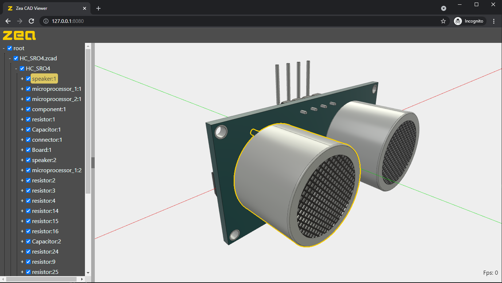

# minimal-zea-viewer

This is a minomal sample application built using vanilla JavaScript, HTML, and WebComponents. It is a simple, framework agnostic sample that shows how to load and render various file formats, while providing a simple tree view to explore the model structure.

# Running the demo

simply run an http-server in the same folder as the sample and load the index.html

You can load data by drag and drop, or using a pick file dialog.

# Live Demo

http://docs.zea.live/minimal-zea-viewer/
